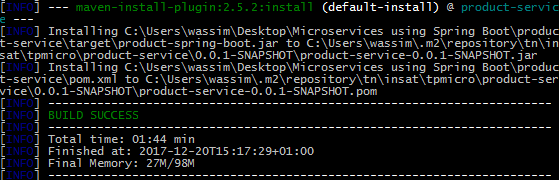

# tp4-eservices : Microservices
This git repository serve the purpose of showing how we managed to **_dockerize_** the microservices that we develop throughout the lab
# Table of content
* What we Have
* Docker
* The steps
  * What we'll need
  * Deploying the microservices as an excutable JAR file
  * Deploying the microservices using the maven plugin
  * _Dockercompose_

# What we have
## The application so far
It's a web REST service that display a list of products. The application is designed using the architecture of [Microservices](http://microservices.io).  
When building our microservices, we ensured that we respect a number of design patterns. Some of them related to microservices and others are general good practices when deploying the services like [Server-side Discorvery](http://microservices.io/patterns/server-side-discovery.html) and the [API gateway](http://microservices.io/patterns/apigateway.html).  
The final architecture of the application looks like this  
<p align="center"></p>  

An overview of the service is provided by the table below  

Name | Role | Port 
--- | --- | --- |  
Product Service | The main service, an API for listing products | 8080
Config Service | The configuration service used to centrelize all the app's configuration | 8888  
Discovery Service | A registery service for the application instances to get discovered by other services|8761
Proxy Service| An API Gateway for request routing and load balancing|9999  

to _containerize_ these microservices we will use [Docker](https://www.docker.com).  

# Docker
According to [wikipedia](https://en.wikipedia.org)
>"Docker is a software technology providing containers, promoted by the company Docker, Inc. Docker provides an additional layer of abstraction and automation of operating-system-level virtualization on Windows and Linux. Docker uses the resource isolation features of the Linux kernel such as cgroups and kernel namespaces, and a union-capable file system such as OverlayFS and others to allow independent "containers" to run within a single Linux instance, avoiding the overhead of starting and maintaining virtual machines (VMs)."

Furthermore, [this article](http://microservices.io/patterns/deployment/service-per-container.html) as well as [this](https://dzone.com/articles/dockercontainers-microservices) helps to understand the importance of containers in a microservice architecture.  
Now let's start building some containers!  

# The Steps

## What we'll need
- Install [Docker](https://www.docker.com/get-docker) (For windows 10 Pro install Docker or for Windows or install "Docker tools" on previous systems)
- Text Editor or an IDE
- Terminal
- Some Patience

**PS** : In the case of installing the Docker tools it will require installing VirtualBox cause the containers will be ran on a linux machine. Docker for Windows uses _Hyper-V_ technology provided by windows 10.

The final project structre looks like this : 

```
├───product-service
│      └───Dockerfile
├───config-service
│      └───Dockerfile
├───discovery-service
│      └───Dockerfile
├───proxy-service
│      └───Dockerfile
└───docker-compose.yml
```

There are **two ways** to deploy your Spring Boot microservices into docker container.  

  1. Creating a docker image from the JAR file
  2. Using _Spotify_'s maven-docker plugin 

## Deploying the microservices as an executable JAR file

### 1. Building the excutable jar file

Using Maven build the service with the command
```cmd
c:/projects/config-service> mvnw install 
``` 
The result looks like this  

<p align="center"></p>

### 2. Dockerfile
this file contains the set of commands that the docker command line will execute on build. We will use this file in the two methods.
in the case of _config-service_ a _dockerfile_ looks like this
```Dockerfile
FROM openjdk:8
ADD target/product-spring-boot.jar product-spring-boot.jar
EXPOSE 8888
ENTRYPOINT ["java", "-jar", "product-spring-boot.jar"]
```
This file will  
1. Get the **openjdk:8** image (it will be downloaded if it's not existing),  
2. **ADD** the result jar file to the docker image,
3. then it **EXPOSES** the port 8888 of the container,
4. The last command (or _step_) is the command line to run the container.

We invoke this Dockerfile and build our docker image by wrinting this command in the docker terminal at you root project (Docker Quickstart Terminal in case of Docker Tools)

```bash
$ cd path/to/project 
$ docker build -f Dockerfile -t product-spring-boot
```
An output should looks like this

<p align="center"></p>

We repeat this process on the remain project and voilà! all the project are sleeping inside the docker images.  
We can check on them using the command
```bash
$ docker images
```
<p align="center"></p>
